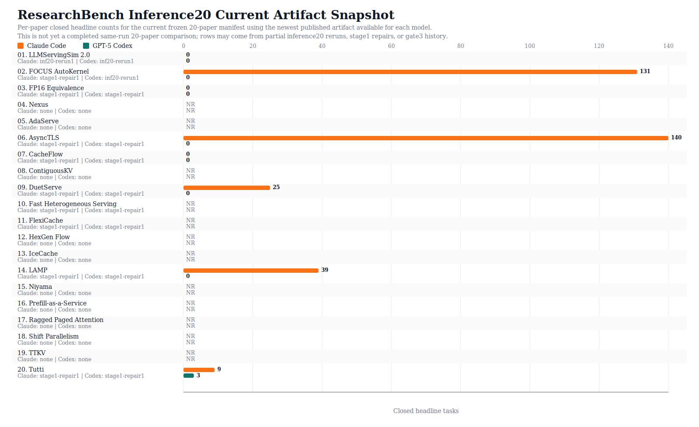

# ResearchBench Results

This page tracks the current frozen `researchbench_inference20_h100` set, the available Codex and Claude Code run artifacts for that set, and the fixed rubric/contracts for every paper.

## 20-Paper Snapshot

No completed full 20-paper Codex-vs-Claude comparison is published yet. The chart below is a current artifact snapshot for the frozen 20-paper manifest: it uses the newest available per-paper artifact for each model, which means some rows come from partial `researchbench_inference20_h100` reruns and older completed gate3/stage1 artifacts fill the gaps.

## Frozen Set

- Benchmark name: `researchbench_inference20_h100`
- Theme: Inference optimization
- Hardware target: `nvidia-h100-80gb`
- Frozen manifest: [`data/frozen_benchmarks/researchbench_inference20_h100/MANIFEST.json`](../data/frozen_benchmarks/researchbench_inference20_h100/MANIFEST.json)

| Paper | arXiv | Rubric | Contracts | Codex (`gpt-5-codex`) | Claude Code (`claude-opus-4-7`) |
| --- | --- | --- | --- | --- | --- |
| [`llmservingsim-2-0-a-unified-simulator-for`](../data/frozen_benchmarks/researchbench_inference20_h100/llmservingsim-2-0-a-unified-simulator-for/inputs/paper.md) | [2304.01433](https://arxiv.org/abs/2304.01433) | [`rubric.json`](../data/frozen_benchmarks/researchbench_inference20_h100/llmservingsim-2-0-a-unified-simulator-for/rubric/rubric.json) | [`verification_contracts.json`](../data/frozen_benchmarks/researchbench_inference20_h100/llmservingsim-2-0-a-unified-simulator-for/contracts/verification_contracts.json) | 0/50 closed failed inf20-rerun1 [`PAPER_RUN_STATUS.json`](../data/frozen_benchmarks/researchbench_inference20_h100/_runs/codex/gpt-5-codex/20260625-gpt-5-codex-inference20-rerun1/llmservingsim-2-0-a-unified-simulator-for/PAPER_RUN_STATUS.json) | 0/50 closed completed inf20-rerun1 [`PAPER_RUN_STATUS.json`](../data/frozen_benchmarks/researchbench_inference20_h100/_runs/claude-code/claude-opus-4-7/20260625-claude-opus-4-7-inference20-rerun1/llmservingsim-2-0-a-unified-simulator-for/PAPER_RUN_STATUS.json) |
| [`FOCUS_autokernel-autonomous-gpu-kernel-optimization-via`](../data/frozen_benchmarks/researchbench_inference20_h100/FOCUS_autokernel-autonomous-gpu-kernel-optimization-via/inputs/paper.md) | — | [`rubric.json`](../data/frozen_benchmarks/researchbench_inference20_h100/FOCUS_autokernel-autonomous-gpu-kernel-optimization-via/rubric/rubric.json) | [`verification_contracts.json`](../data/frozen_benchmarks/researchbench_inference20_h100/FOCUS_autokernel-autonomous-gpu-kernel-optimization-via/contracts/verification_contracts.json) | 0/131 closed crashed inf20-rerun1 [`PAPER_RUN_STATUS.json`](../data/frozen_benchmarks/researchbench_inference20_h100/_runs/codex/gpt-5-codex/20260625-gpt-5-codex-inference20-rerun1/FOCUS_autokernel-autonomous-gpu-kernel-optimization-via/PAPER_RUN_STATUS.json) | 131/131 closed completed stage1-repair1 [`PAPER_RUN_STATUS.json`](../data/frozen_benchmarks/researchbench_inference10_h100_stage1/_runs/claude-code/claude-opus-4-7/20260626-claude-opus-4-7-inference10-stage1-repair1/FOCUS_autokernel-autonomous-gpu-kernel-optimization-via/PAPER_RUN_STATUS.json) |
| [`the-illusion-of-equivalence-systematic-fp16`](../data/frozen_benchmarks/researchbench_inference20_h100/the-illusion-of-equivalence-systematic-fp16/inputs/paper.md) | — | [`rubric.json`](../data/frozen_benchmarks/researchbench_inference20_h100/the-illusion-of-equivalence-systematic-fp16/rubric/rubric.json) | [`verification_contracts.json`](../data/frozen_benchmarks/researchbench_inference20_h100/the-illusion-of-equivalence-systematic-fp16/contracts/verification_contracts.json) | 0/138 closed failed stage1-repair1 [`PAPER_RUN_STATUS.json`](../data/frozen_benchmarks/researchbench_inference10_h100_stage1/_runs/codex/gpt-5-codex/20260626-gpt-5-codex-inference10-stage1-repair1/the-illusion-of-equivalence-systematic-fp16/PAPER_RUN_STATUS.json) | 0/138 closed completed stage1-repair1 [`PAPER_RUN_STATUS.json`](../data/frozen_benchmarks/researchbench_inference10_h100_stage1/_runs/claude-code/claude-opus-4-7/20260626-claude-opus-4-7-inference10-stage1-repair1/the-illusion-of-equivalence-systematic-fp16/PAPER_RUN_STATUS.json) |
| [`nexus-proactive-intra-gpu-disaggregation-of`](../data/frozen_benchmarks/researchbench_inference20_h100/nexus-proactive-intra-gpu-disaggregation-of/inputs/paper.md) | [2005.14165](https://arxiv.org/abs/2005.14165) | [`rubric.json`](../data/frozen_benchmarks/researchbench_inference20_h100/nexus-proactive-intra-gpu-disaggregation-of/rubric/rubric.json) | [`verification_contracts.json`](../data/frozen_benchmarks/researchbench_inference20_h100/nexus-proactive-intra-gpu-disaggregation-of/contracts/verification_contracts.json) | not yet benchmarked | not yet benchmarked |
| [`adaserve-accelerating-multi-slo-llm-serving-with`](../data/frozen_benchmarks/researchbench_inference20_h100/adaserve-accelerating-multi-slo-llm-serving-with/inputs/paper.md) | — | [`rubric.json`](../data/frozen_benchmarks/researchbench_inference20_h100/adaserve-accelerating-multi-slo-llm-serving-with/rubric/rubric.json) | [`verification_contracts.json`](../data/frozen_benchmarks/researchbench_inference20_h100/adaserve-accelerating-multi-slo-llm-serving-with/contracts/verification_contracts.json) | not yet benchmarked | not yet benchmarked |
| [`asynctls-efficient-generative-llm-inference-with`](../data/frozen_benchmarks/researchbench_inference20_h100/asynctls-efficient-generative-llm-inference-with/inputs/paper.md) | — | [`rubric.json`](../data/frozen_benchmarks/researchbench_inference20_h100/asynctls-efficient-generative-llm-inference-with/rubric/rubric.json) | [`verification_contracts.json`](../data/frozen_benchmarks/researchbench_inference20_h100/asynctls-efficient-generative-llm-inference-with/contracts/verification_contracts.json) | 0/140 closed crashed stage1-repair1 [`PAPER_RUN_STATUS.json`](../data/frozen_benchmarks/researchbench_inference10_h100_stage1/_runs/codex/gpt-5-codex/20260626-gpt-5-codex-inference10-stage1-repair1/asynctls-efficient-generative-llm-inference-with/PAPER_RUN_STATUS.json) | 140/140 closed completed stage1-repair1 [`PAPER_RUN_STATUS.json`](../data/frozen_benchmarks/researchbench_inference10_h100_stage1/_runs/claude-code/claude-opus-4-7/20260626-claude-opus-4-7-inference10-stage1-repair1/asynctls-efficient-generative-llm-inference-with/PAPER_RUN_STATUS.json) |
| [`cacheflow-efficient-llm-serving-with-3d-parallel`](../data/frozen_benchmarks/researchbench_inference20_h100/cacheflow-efficient-llm-serving-with-3d-parallel/inputs/paper.md) | [2310.06770](https://arxiv.org/abs/2310.06770) | [`rubric.json`](../data/frozen_benchmarks/researchbench_inference20_h100/cacheflow-efficient-llm-serving-with-3d-parallel/rubric/rubric.json) | [`verification_contracts.json`](../data/frozen_benchmarks/researchbench_inference20_h100/cacheflow-efficient-llm-serving-with-3d-parallel/contracts/verification_contracts.json) | 0/44 closed crashed stage1-repair1 [`PAPER_RUN_STATUS.json`](../data/frozen_benchmarks/researchbench_inference10_h100_stage1/_runs/codex/gpt-5-codex/20260626-gpt-5-codex-inference10-stage1-repair1/cacheflow-efficient-llm-serving-with-3d-parallel/PAPER_RUN_STATUS.json) | 0/44 closed completed stage1-repair1 [`PAPER_RUN_STATUS.json`](../data/frozen_benchmarks/researchbench_inference10_h100_stage1/_runs/claude-code/claude-opus-4-7/20260626-claude-opus-4-7-inference10-stage1-repair1/cacheflow-efficient-llm-serving-with-3d-parallel/PAPER_RUN_STATUS.json) |
| [`contiguouskv-accelerating-llm-prefill-with`](../data/frozen_benchmarks/researchbench_inference20_h100/contiguouskv-accelerating-llm-prefill-with/inputs/paper.md) | — | [`rubric.json`](../data/frozen_benchmarks/researchbench_inference20_h100/contiguouskv-accelerating-llm-prefill-with/rubric/rubric.json) | [`verification_contracts.json`](../data/frozen_benchmarks/researchbench_inference20_h100/contiguouskv-accelerating-llm-prefill-with/contracts/verification_contracts.json) | not yet benchmarked | not yet benchmarked |
| [`duetserve-harmonizing-prefill-and-decode-for-llm`](../data/frozen_benchmarks/researchbench_inference20_h100/duetserve-harmonizing-prefill-and-decode-for-llm/inputs/paper.md) | [2402.17177](https://arxiv.org/abs/2402.17177) | [`rubric.json`](../data/frozen_benchmarks/researchbench_inference20_h100/duetserve-harmonizing-prefill-and-decode-for-llm/rubric/rubric.json) | [`verification_contracts.json`](../data/frozen_benchmarks/researchbench_inference20_h100/duetserve-harmonizing-prefill-and-decode-for-llm/contracts/verification_contracts.json) | 0/140 closed failed stage1-repair1 [`PAPER_RUN_STATUS.json`](../data/frozen_benchmarks/researchbench_inference10_h100_stage1/_runs/codex/gpt-5-codex/20260626-gpt-5-codex-inference10-stage1-repair1/duetserve-harmonizing-prefill-and-decode-for-llm/PAPER_RUN_STATUS.json) | 25/140 closed completed stage1-repair1 [`PAPER_RUN_STATUS.json`](../data/frozen_benchmarks/researchbench_inference10_h100_stage1/_runs/claude-code/claude-opus-4-7/20260626-claude-opus-4-7-inference10-stage1-repair1/duetserve-harmonizing-prefill-and-decode-for-llm/PAPER_RUN_STATUS.json) |
| [`fast-heterogeneous-serving-scalable-mixed-scale`](../data/frozen_benchmarks/researchbench_inference20_h100/fast-heterogeneous-serving-scalable-mixed-scale/inputs/paper.md) | — | [`rubric.json`](../data/frozen_benchmarks/researchbench_inference20_h100/fast-heterogeneous-serving-scalable-mixed-scale/rubric/rubric.json) | [`verification_contracts.json`](../data/frozen_benchmarks/researchbench_inference20_h100/fast-heterogeneous-serving-scalable-mixed-scale/contracts/verification_contracts.json) | n/a closed crashed stage1-repair1 [`PAPER_RUN_STATUS.json`](../data/frozen_benchmarks/researchbench_inference10_h100_stage1/_runs/codex/gpt-5-codex/20260626-gpt-5-codex-inference10-stage1-repair1/fast-heterogeneous-serving-scalable-mixed-scale/PAPER_RUN_STATUS.json) | n/a closed crashed stage1-repair1 [`PAPER_RUN_STATUS.json`](../data/frozen_benchmarks/researchbench_inference10_h100_stage1/_runs/claude-code/claude-opus-4-7/20260626-claude-opus-4-7-inference10-stage1-repair1/fast-heterogeneous-serving-scalable-mixed-scale/PAPER_RUN_STATUS.json) |
| [`flexicache-leveraging-temporal-stability-of`](../data/frozen_benchmarks/researchbench_inference20_h100/flexicache-leveraging-temporal-stability-of/inputs/paper.md) | — | [`rubric.json`](../data/frozen_benchmarks/researchbench_inference20_h100/flexicache-leveraging-temporal-stability-of/rubric/rubric.json) | [`verification_contracts.json`](../data/frozen_benchmarks/researchbench_inference20_h100/flexicache-leveraging-temporal-stability-of/contracts/verification_contracts.json) | n/a closed crashed stage1-repair1 [`PAPER_RUN_STATUS.json`](../data/frozen_benchmarks/researchbench_inference10_h100_stage1/_runs/codex/gpt-5-codex/20260626-gpt-5-codex-inference10-stage1-repair1/flexicache-leveraging-temporal-stability-of/PAPER_RUN_STATUS.json) | n/a closed crashed stage1-repair1 [`PAPER_RUN_STATUS.json`](../data/frozen_benchmarks/researchbench_inference10_h100_stage1/_runs/claude-code/claude-opus-4-7/20260626-claude-opus-4-7-inference10-stage1-repair1/flexicache-leveraging-temporal-stability-of/PAPER_RUN_STATUS.json) |
| [`hexgen-flow-optimizing-llm-inference-request`](../data/frozen_benchmarks/researchbench_inference20_h100/hexgen-flow-optimizing-llm-inference-request/inputs/paper.md) | — | [`rubric.json`](../data/frozen_benchmarks/researchbench_inference20_h100/hexgen-flow-optimizing-llm-inference-request/rubric/rubric.json) | [`verification_contracts.json`](../data/frozen_benchmarks/researchbench_inference20_h100/hexgen-flow-optimizing-llm-inference-request/contracts/verification_contracts.json) | not yet benchmarked | not yet benchmarked |
| [`icecache-memory-efficient-kv-cache-management-for`](../data/frozen_benchmarks/researchbench_inference20_h100/icecache-memory-efficient-kv-cache-management-for/inputs/paper.md) | — | [`rubric.json`](../data/frozen_benchmarks/researchbench_inference20_h100/icecache-memory-efficient-kv-cache-management-for/rubric/rubric.json) | [`verification_contracts.json`](../data/frozen_benchmarks/researchbench_inference20_h100/icecache-memory-efficient-kv-cache-management-for/contracts/verification_contracts.json) | not yet benchmarked | not yet benchmarked |
| [`lamp-look-ahead-mixed-precision-inference-of`](../data/frozen_benchmarks/researchbench_inference20_h100/lamp-look-ahead-mixed-precision-inference-of/inputs/paper.md) | — | [`rubric.json`](../data/frozen_benchmarks/researchbench_inference20_h100/lamp-look-ahead-mixed-precision-inference-of/rubric/rubric.json) | [`verification_contracts.json`](../data/frozen_benchmarks/researchbench_inference20_h100/lamp-look-ahead-mixed-precision-inference-of/contracts/verification_contracts.json) | 0/39 closed crashed stage1-repair1 [`PAPER_RUN_STATUS.json`](../data/frozen_benchmarks/researchbench_inference10_h100_stage1/_runs/codex/gpt-5-codex/20260626-gpt-5-codex-inference10-stage1-repair1/lamp-look-ahead-mixed-precision-inference-of/PAPER_RUN_STATUS.json) | 39/39 closed completed stage1-repair1 [`PAPER_RUN_STATUS.json`](../data/frozen_benchmarks/researchbench_inference10_h100_stage1/_runs/claude-code/claude-opus-4-7/20260626-claude-opus-4-7-inference10-stage1-repair1/lamp-look-ahead-mixed-precision-inference-of/PAPER_RUN_STATUS.json) |
| [`niyama-breaking-the-silos-of-llm-inference-serving`](../data/frozen_benchmarks/researchbench_inference20_h100/niyama-breaking-the-silos-of-llm-inference-serving/inputs/paper.md) | [2405.04437](https://arxiv.org/abs/2405.04437) | [`rubric.json`](../data/frozen_benchmarks/researchbench_inference20_h100/niyama-breaking-the-silos-of-llm-inference-serving/rubric/rubric.json) | [`verification_contracts.json`](../data/frozen_benchmarks/researchbench_inference20_h100/niyama-breaking-the-silos-of-llm-inference-serving/contracts/verification_contracts.json) | not yet benchmarked | not yet benchmarked |
| [`prefill-as-a-service-kvcache-of-next-generation`](../data/frozen_benchmarks/researchbench_inference20_h100/prefill-as-a-service-kvcache-of-next-generation/inputs/paper.md) | — | [`rubric.json`](../data/frozen_benchmarks/researchbench_inference20_h100/prefill-as-a-service-kvcache-of-next-generation/rubric/rubric.json) | [`verification_contracts.json`](../data/frozen_benchmarks/researchbench_inference20_h100/prefill-as-a-service-kvcache-of-next-generation/contracts/verification_contracts.json) | not yet benchmarked | not yet benchmarked |
| [`ragged-paged-attention-a-high-performance-and`](../data/frozen_benchmarks/researchbench_inference20_h100/ragged-paged-attention-a-high-performance-and/inputs/paper.md) | — | [`rubric.json`](../data/frozen_benchmarks/researchbench_inference20_h100/ragged-paged-attention-a-high-performance-and/rubric/rubric.json) | [`verification_contracts.json`](../data/frozen_benchmarks/researchbench_inference20_h100/ragged-paged-attention-a-high-performance-and/contracts/verification_contracts.json) | not yet benchmarked | not yet benchmarked |
| [`shift-parallelism-low-latency-high-throughput-llm`](../data/frozen_benchmarks/researchbench_inference20_h100/shift-parallelism-low-latency-high-throughput-llm/inputs/paper.md) | [1904.10509](https://arxiv.org/abs/1904.10509) | [`rubric.json`](../data/frozen_benchmarks/researchbench_inference20_h100/shift-parallelism-low-latency-high-throughput-llm/rubric/rubric.json) | [`verification_contracts.json`](../data/frozen_benchmarks/researchbench_inference20_h100/shift-parallelism-low-latency-high-throughput-llm/contracts/verification_contracts.json) | not yet benchmarked | not yet benchmarked |
| [`ttkv-temporal-tiered-kv-cache-for-long-context`](../data/frozen_benchmarks/researchbench_inference20_h100/ttkv-temporal-tiered-kv-cache-for-long-context/inputs/paper.md) | — | [`rubric.json`](../data/frozen_benchmarks/researchbench_inference20_h100/ttkv-temporal-tiered-kv-cache-for-long-context/rubric/rubric.json) | [`verification_contracts.json`](../data/frozen_benchmarks/researchbench_inference20_h100/ttkv-temporal-tiered-kv-cache-for-long-context/contracts/verification_contracts.json) | not yet benchmarked | not yet benchmarked |
| [`tutti-making-ssd-backed-kv-cache-practical-for`](../data/frozen_benchmarks/researchbench_inference20_h100/tutti-making-ssd-backed-kv-cache-practical-for/inputs/paper.md) | [2307.11088](https://arxiv.org/abs/2307.11088) | [`rubric.json`](../data/frozen_benchmarks/researchbench_inference20_h100/tutti-making-ssd-backed-kv-cache-practical-for/rubric/rubric.json) | [`verification_contracts.json`](../data/frozen_benchmarks/researchbench_inference20_h100/tutti-making-ssd-backed-kv-cache-practical-for/contracts/verification_contracts.json) | 3/98 closed failed stage1-repair1 [`PAPER_RUN_STATUS.json`](../data/frozen_benchmarks/researchbench_inference10_h100_stage1/_runs/codex/gpt-5-codex/20260626-gpt-5-codex-inference10-stage1-repair1/tutti-making-ssd-backed-kv-cache-practical-for/PAPER_RUN_STATUS.json) | 9/98 closed completed stage1-repair1 [`PAPER_RUN_STATUS.json`](../data/frozen_benchmarks/researchbench_inference10_h100_stage1/_runs/claude-code/claude-opus-4-7/20260626-claude-opus-4-7-inference10-stage1-repair1/tutti-making-ssd-backed-kv-cache-practical-for/PAPER_RUN_STATUS.json) |

## Notes

- `not yet benchmarked` means no `PAPER_RUN_STATUS.json` exists yet for that paper/model in the current published artifacts.
- `stage1-repair1` and `gate3-*` rows are historical comparison artifacts reused here only because the current 20-paper reruns on disk are incomplete.
- Once full Codex and Claude Code `researchbench_inference20_h100` runs complete, this page should be simplified to a single same-set comparison table and chart.
